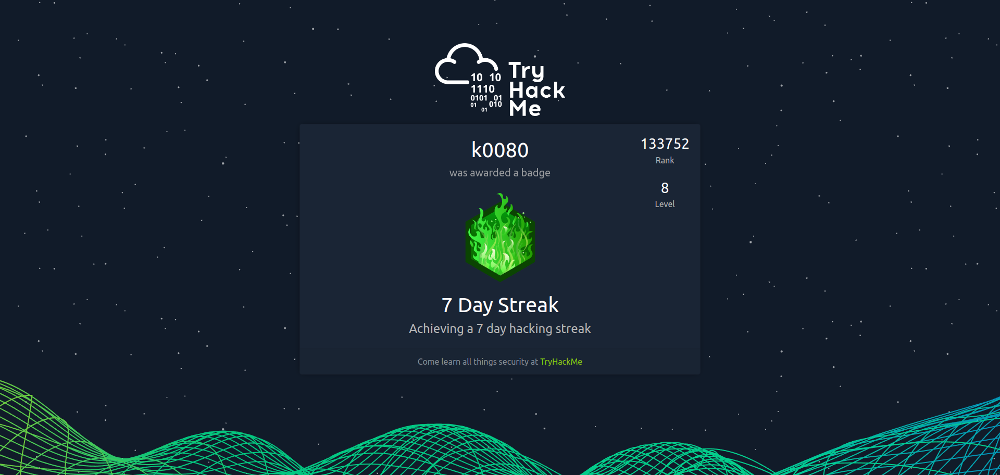
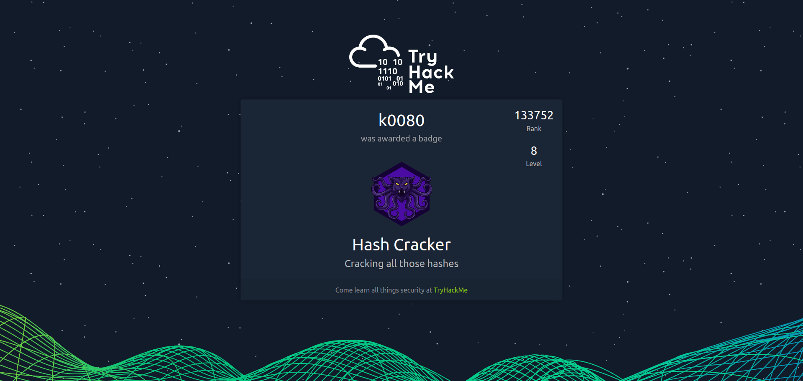
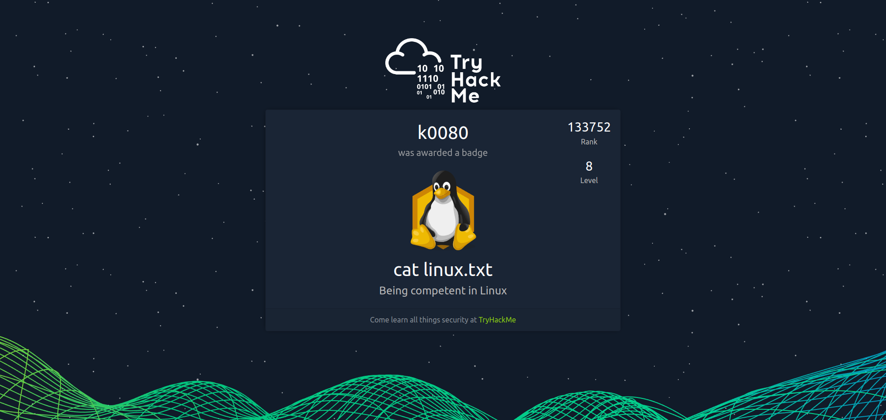
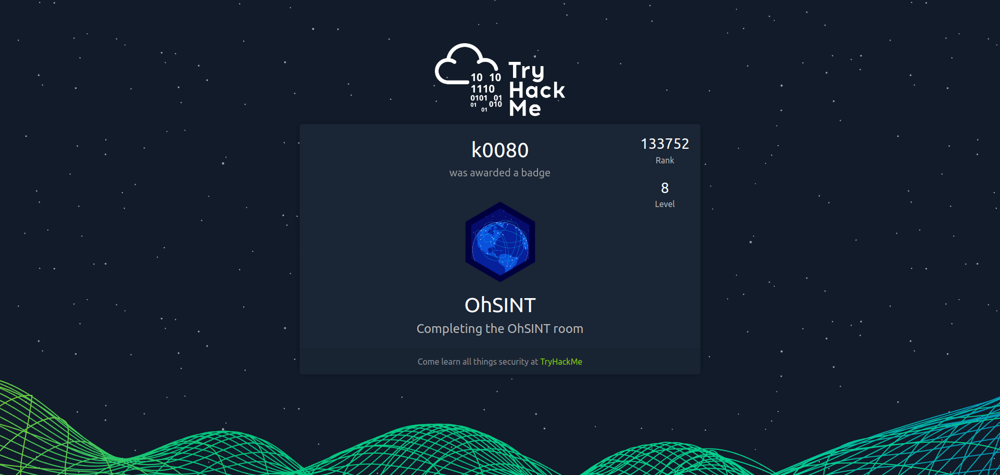

# TryHackMe

## Badges

## Completed Rooms

[Become a Hacker](https://tryhackme.com/r/room/becomeahackeroa)

[Intro to Docker](https://tryhackme.com/r/room/introtodockerk8pdqk)

[Intro to Offensive Security](https://tryhackme.com/r/room/introtooffensivesecurity)

[h4cked](https://tryhackme.com/r/room/h4cked)

[Encryption - Crypto 101](https://tryhackme.com/r/room/encryptioncrypto101)

[Tutorial](https://tryhackme.com/r/room/tutorial)

[Reversing ELF](https://tryhackme.com/r/room/reverselfiles)

[Simple CTF](https://tryhackme.com/r/room/easyctf)

[c4ptur3-th3-fl4g](https://tryhackme.com/r/room/c4ptur3th3fl4g)

[OhSINT](https://tryhackme.com/r/room/ohsint)

[Careers in Cyber](https://tryhackme.com/r/room/careersincyber)

[Intro to Defensive Security](https://tryhackme.com/r/room/defensivesecurity)

[Web Application Security](https://tryhackme.com/r/room/introwebapplicationsecurity)

[Intro to Digital Forensics](https://tryhackme.com/r/room/introdigitalforensics)

[Metasploit: Introduction](https://tryhackme.com/r/room/metasploitintro)

[Vulnerabilities 101](https://tryhackme.com/r/room/vulnerabilities101)

[Pentesting Fundamentals](https://tryhackme.com/r/room/pentestingfundamentals)

[Learning Cyber Security](https://tryhackme.com/r/room/beginnerpathintro)

[Linux Fundamentals Part1](https://tryhackme.com/r/room/linuxfundamentalspart1)

[Basic Pentesting](https://tryhackme.com/r/room/basicpentestingjt)

[Registry Persistence Detection](https://tryhackme.com/r/room/registrypersistencedetection)

[History of Malware](https://tryhackme.com/r/room/historyofmalware)

[Agent Sudo](https://tryhackme.com/r/room/agentsudoctf)

[Crack the hash](https://tryhackme.com/r/room/crackthehash)
